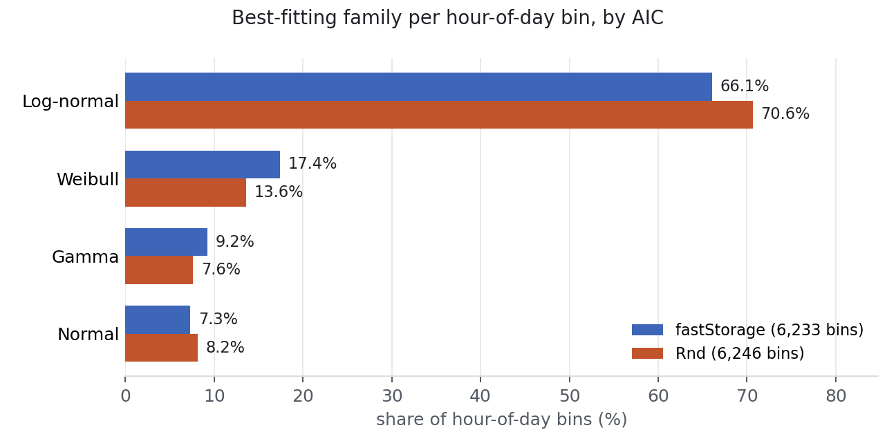

# Scoping experiment: log-normal CPU fit on public traces

This folder tests one of the main claims in the report, "CPU utilization at a
given load is log-normal", on data outside the original 2011 study. The
purpose is to establish whether the claim survives independent replication
before writing a full paper around it.

## Datasets

Two publicly-hosted Bitbrains traces from the Grid Workloads Archive at
TU Delft (<https://atlarge-research.com/gwa-t-12/>), sampled every 5 minutes
over about 30 days. Column used: `CPU usage [%]`.

- **fastStorage** — 1,250 VMs connected to SAN storage.
- **Rnd** — about 500 VMs on locally-attached storage, released across three
  monthly windows.

Acknowledgement to Bitbrains IT Services Inc. is included per the trace's
usage terms.

## Method

For each of 300 randomly-sampled VMs per dataset, we grouped CPU% readings by
hour of day (24 bins per VM). Every bin with at least 60 samples was retained.
For each retained bin we fit four two-parameter candidate distributions and
scored them:

- **log-normal** (`scipy.stats.lognorm`, `floc=0`)
- **normal** (`scipy.stats.norm`)
- **gamma** (`scipy.stats.gamma`, `floc=0`)
- **Weibull** (`scipy.stats.weibull_min`, `floc=0`)

Each fit produces an AIC and a one-sample Kolmogorov-Smirnov statistic
against the fitted CDF. The "best fit" for a bin is the family with the
smallest AIC.

Reproduction:

```bash
# from this folder, after placing the traces under the paths in fit.py / fit_rnd.py
python fit.py         # fastStorage
python fit_rnd.py     # Rnd
python build_paper_macros.py   # combined stats + chart + LaTeX macros
```

Seed `42`. Runtime about two minutes per trace on a laptop.

## Results

Two independent public traces, 533 VMs, 12,479 hour-of-day bins.

### Best-fitting distribution per bin (share of bins, by AIC)

| Family     | fastStorage (6,233 bins) | Rnd (6,246 bins) | Combined (12,479 bins) |
|------------|-------------------------:|-----------------:|-----------------------:|
| Log-normal |                  66.05%  |          70.64%  |                68.35%  |
| Weibull    |                  17.42%  |          13.58%  |                15.50%  |
| Gamma      |                   9.23%  |           7.62%  |                 8.42%  |
| Normal     |                   7.30%  |           8.17%  |                 7.73%  |



### Median AIC per family (lower is better)

| Family     | fastStorage | Rnd     |
|------------|------------:|--------:|
| Log-normal |      205.7  |  146.5  |
| Gamma      |      250.7  |  211.9  |
| Weibull    |      350.9  |  335.5  |
| Normal     |      369.3  |  396.1  |

### Pairwise, combined trace

| Comparison                | Median AIC delta | Log-normal wins | Wins by delta AIC >= 2 |
|---------------------------|-----------------:|----------------:|-----------------------:|
| Log-normal vs. Normal     |          -108.6  |         76.39%  |                75.67%  |
| Log-normal vs. Gamma      |           -17.5  |         68.35%  |                64.98%  |
| Log-normal vs. Weibull    |           -76.5  |         75.74%  |                75.30%  |

A delta of about 2 or more in AIC is the conventional threshold for
substantial evidence in favor of the lower model.

The Kolmogorov-Smirnov test rejects every family at 5% in almost every bin,
which is expected KS behavior with parameters estimated from data at sample
sizes of hundreds to thousands. All four families are rejected at similar
rates, so KS is not discriminating here; AIC is.

## Interpretation

The log-normal claim replicates on two independent public traces from
different fleets. Log-normal is the best-fitting family among the four
standard candidates in 68% of hourly bins overall, with substantial median
AIC gaps over each alternative.

Gamma is the strongest alternative on both traces (12- to 25-point median
AIC gap, losing on ~68% of bins). The distinction is mechanistic: log-normal
follows from each new transaction adding CPU load in proportion to the load
already present, while gamma follows from additive Poisson arrivals with
fixed per-request cost. A follow-up paper would test the multiplicative
mechanism directly using arrival-rate-paired CPU data.

## Files

- `fit.py`, `fit_rnd.py`: analysis scripts for the two traces.
- `build_paper_macros.py`: combines both result sets and writes
  `../paper/paper_macros.tex` and a combined chart.
- `bitbrains_fit_results.csv`, `rnd_fit_results.csv`: per-bin results
  (VM, hour, sample count, mean, std, per-family AIC and KS p-value,
  best-by-AIC label).
- `bitbrains_summary.json`, `rnd_summary.json`: per-trace aggregate summaries.
- `best_fit_share.png`: combined bar chart of best-fit shares.
