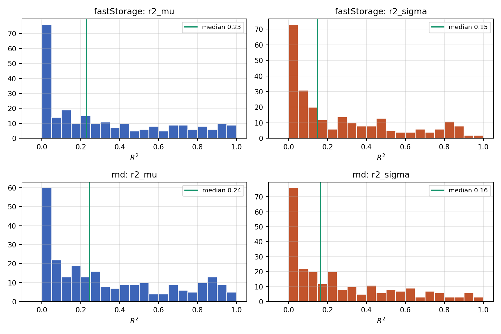
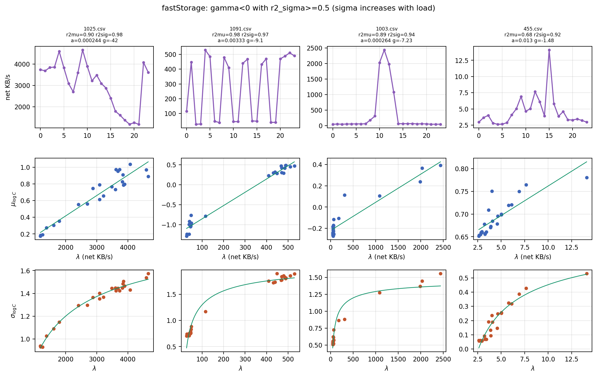
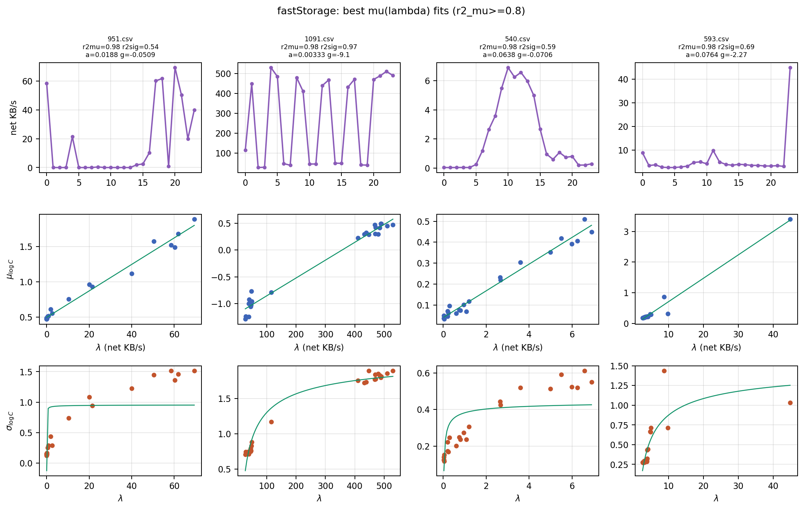
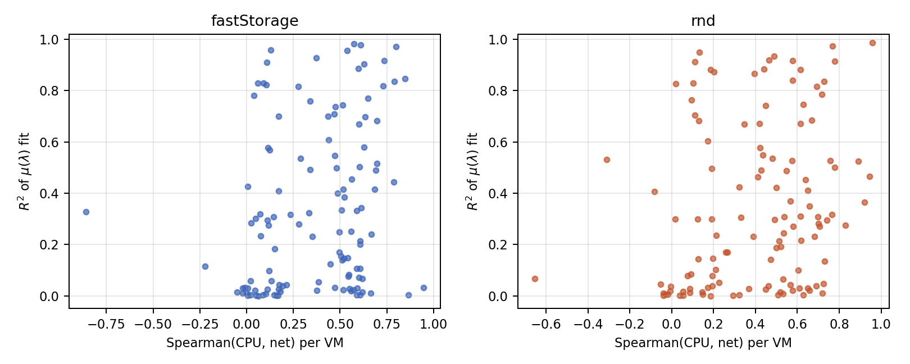

# Diagnosis of the Negative Parameter-Scaling Result (Paper Section 6)

**Script:** `scaling_diagnose.py` (inputs: `scaling_fastStorage.csv`, `scaling_rnd.csv`, raw Bitbrains VM CSVs; per-bin construction identical to `scaling_fit.py`). Per-VM proxy statistics are saved to `diag_proxy.csv`.

**Question.** Section 6 reports median R² of 0.23 (fastStorage) and 0.24 (rnd) for the μ(λ) fit, weaker still for σ(λ), and a median γ̂ of the wrong sign. The paper offers two candidate causes: (i) network throughput is a poor proxy for arrival rate; (ii) Bitbrains workload heterogeneity. This diagnostic inspects the failing and extreme VMs directly and tests hypothesis (i).

## 1. The R² distributions are bimodal in effect, not uniformly bad

*Figure 1 (`diag_r2_hist.png`). Histograms of per-VM R² for the μ(λ) fit (blue) and σ(λ) fit (orange) on both traces; green line marks the median.*

The median hides a wide spread. On fastStorage the μ(λ) R² quantiles are 0.004 / 0.031 / 0.23 / 0.58 / 0.84 at the 10/25/50/75/90th percentiles; rnd is nearly identical. A quarter of VMs are pure noise (R² < 0.05), while 13 to 15 percent fit at R² ≥ 0.8. The failure is therefore a mixture: a large no-signal population plus a substantial population where μ(λ) is strongly linear. Good-fit VMs are higher-load: median λ_max is 44.9 KB/s among R² ≥ 0.8 VMs versus 9.5 among the rest on fastStorage (27.4 vs 9.8 on rnd), and Spearman(log₁₀ λ_max, R²_μ) = 0.37 / 0.26. Low-traffic VMs have essentially no leverage in λ, so their fits are noise; this is a proxy-range problem, consistent with hypothesis (i) for the μ clause.

## 2. The wrong-sign γ̂ is not noise: σ systematically rises with load

Sign counts on the full panels:

| Trace | α̂ < 0 | γ̂ < 0 (all) | γ̂ < 0 among R²_σ ≥ 0.5 |
|---|---|---|---|
| fastStorage | 15% (38/253) | 77% (191/247) | **98%** (51/52) |
| rnd | 10% (26/251) | 87% (213/245) | **100%** (55/55) |

α̂ is positive for 85 to 90 percent of VMs: the mean clause has the predicted direction. γ̂ is negative for the overwhelming majority, and the conditioning is the key finding: **restricting to VMs where the σ(λ) curve actually fits well (R²_σ ≥ 0.5) makes the wrong sign nearly universal.** A noise-driven sign error would dilute, not concentrate, under that restriction. The σ(λ) relation in Bitbrains is real, well fit by the γ/√λ + δ family, and increasing in λ: σ is smallest at low load and grows concavely toward a plateau as load rises, the mirror image of the predicted 1/√λ shrinkage.

*Figure 2 (`diag_cases_wrong_sign.png`). Four fastStorage VMs with γ̂ < 0 and R²_σ ≥ 0.5. Rows: hour-of-day network profile; μ vs λ with the linear fit; σ vs λ with the fitted curve.*

Representative cases (fastStorage):

- **1025.csv** (R²_μ = 0.90, R²_σ = 0.98, γ̂ = −42): a high-traffic VM (λ between 1189 and 4652 KB/s) with a smooth diurnal cycle. μ rises cleanly from 0.2 to 1.0 with λ, and σ rises from 0.93 to 1.58 along an almost perfect concave curve. Both clauses have strong signal; the variance clause has the opposite direction to the prediction.
- **1091.csv** (R²_μ = 0.98, R²_σ = 0.97, γ̂ = −9.1): an alternating on/off load profile (hours cycle between roughly 40 and 500 KB/s). The bins form two clusters; both μ and σ are higher in the high-load cluster. The high R² here comes from a two-cluster contrast, but the direction is unambiguous.
- **1003.csv** (R²_μ = 0.89, R²_σ = 0.94, γ̂ = −7.2): a batch-like VM, quiet except for a burst around hours 10 to 13; σ roughly triples (0.55 to 1.55) during the burst hours.
- **455.csv** (R²_σ = 0.92, γ̂ = −1.5): a low-traffic VM (λ from 2.6 to 14 KB/s) showing the same increasing σ(λ) at small scale (0.06 to 0.53).

## 3. Good μ fits are high-load VMs with clean diurnal or on/off structure, and they too show γ̂ < 0

*Figure 3 (`diag_cases_good_mu.png`). Four fastStorage VMs with the highest R²_μ (all 0.98). Same panel layout as Figure 2.*

The best μ(λ) fitters (951, 1091, 540, 593; all R²_μ = 0.98) share two traits: a wide λ range within the day (either a smooth diurnal hump, as in 540, or a strong on/off alternation, as in 951 and 1091) and enough traffic for the network proxy to carry signal. For these VMs the mean clause of the law holds well: log CPU rises linearly in throughput. Every one of them nevertheless has γ̂ < 0. The σ panels show the same increasing pattern, sometimes steeper than the fitted curve can follow (951, 540: σ jumps from about 0.2 in quiet hours to 1.4 to 1.5 or 0.6 in busy hours).

## 4. Direct test of the proxy hypothesis

For 120 sampled VMs per trace, `scaling_diagnose.py` computes the sample-level Spearman correlation between CPU and network throughput (5-minute samples), then conditions the scaling-fit outcomes on proxy quality.

*Figure 4 (`diag_proxy_vs_fit.png`). Per-VM Spearman(CPU, network) against R² of the μ(λ) fit; fastStorage left, rnd right.*

- Proxy quality is genuinely mixed: median Spearman(CPU, net) is 0.46 (fastStorage) and 0.45 (rnd), with the 10th percentile near zero. Roughly 40 percent of sampled VMs have ρ < 0.2; for them, median R²_μ is 0.06 to 0.08. So hypothesis (i) does explain the large no-signal mass in Figure 1.
- Among strongly proxied VMs (ρ ≥ 0.5), median R²_μ rises to 0.31 to 0.33, and Spearman(ρ, R²_μ) ≈ 0.27 on both traces: better proxy, better μ fit, as (i) predicts.
- **The decisive cell refutes (i) as an explanation for the γ sign.** Among VMs that are both strongly proxied (ρ ≥ 0.5) and have a well-fitting σ curve (R²_σ ≥ 0.5), γ̂ < 0 in 24 of 24 across both traces (median γ̂ = −0.87). If the wrong sign were an artifact of a broken proxy, it would weaken in exactly this cell. It does not; it is unanimous.

## 5. Conclusion

The two clauses of the scaling law fail for different reasons, and the paper's current text conflates them.

1. **The μ clause is supported where it is testable.** α̂ > 0 for 85 to 90 percent of VMs, and the low median R² is driven by low-traffic VMs where network throughput carries no CPU signal (hypothesis (i)) plus VMs with a narrow within-day λ range. Where the proxy works and λ varies, μ(λ) is linear with R² up to 0.98.
2. **The σ clause is refuted on this data, and the proxy is not the reason.** σ_log C increases with load, concavely, on essentially every VM where the relation is measurable at all, including every well-proxied one. This is a coherent empirical regularity with the opposite direction to the 1/√λ prediction, not a failure to detect the predicted one.
3. **The likely third cause, consistent with reason (ii) but sharper:** the 1/√λ shrinkage comes from CLT averaging of per-request contributions within a measurement window. At 5-minute sampling each reading already averages thousands of events, so that term is negligible; the dispersion measured across an hour-of-day bin (samples pooled over many days) is instead dominated by day-to-day and within-hour load fluctuation, which is multiplicative and grows with the load level. Busy hours are more variable, not less. The original 2011 setting (5-second windows, single transaction class) sits in the regime where per-window event counts are small enough for the CLT term to dominate; Bitbrains does not.

**Recommended framing for Section 6:** report the mean clause as directionally confirmed with proxy-limited R², and the variance clause as refuted in direction on 5-minute data, with the aggregation-window argument as the mechanism-consistent explanation. The current wording, which attributes the whole failure to the proxy and heterogeneity, is contradicted by the 24-of-24 well-proxied wrong-sign cell.
