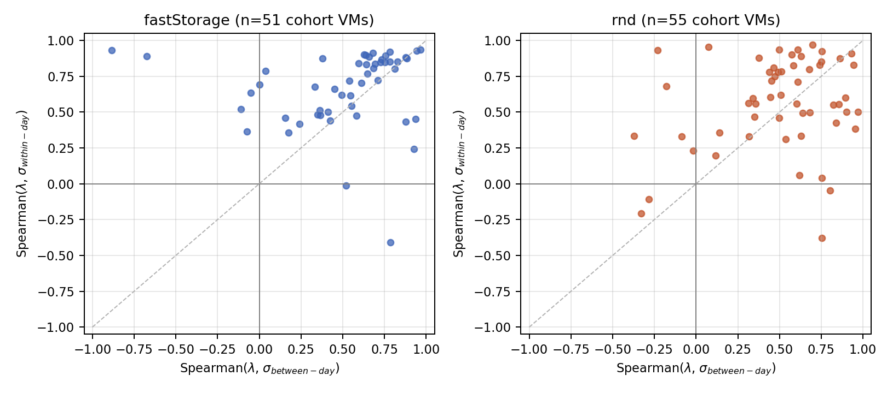
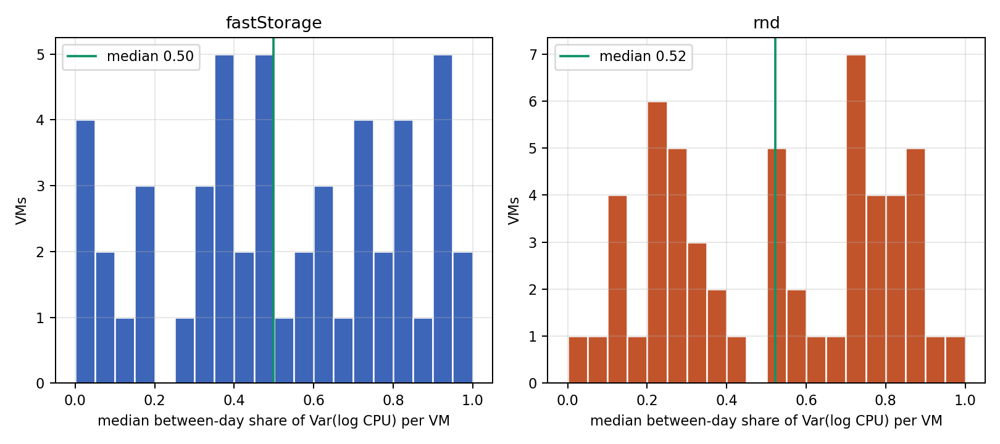
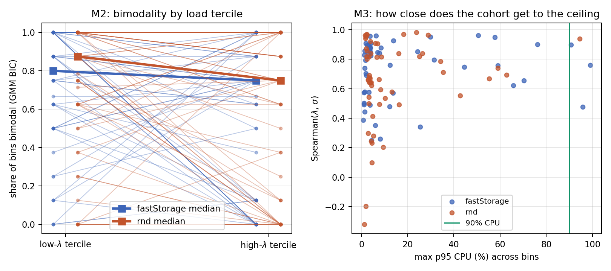
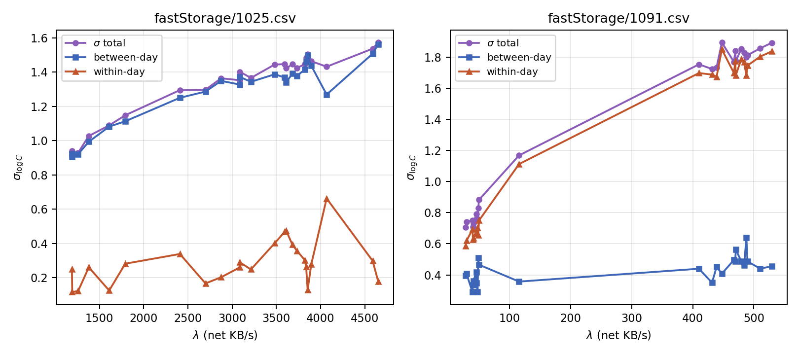

# Root Cause of the Observed sigma(lambda) Growth (gamma_hat < 0)

**Script:** `sigma_rootcause.py` (inputs: `scaling_fastStorage.csv`, `scaling_rnd.csv`, `diag_proxy.csv`, raw Bitbrains VM CSVs; bin construction identical to `scaling_diagnose.py`). Per-bin decomposition rows are in `rc_decomp.csv`, per-VM summaries in `rc_vm_summary.csv`.

**Question.** `SCALING_DIAGNOSIS.md` established that sigma_log C rises with load on essentially every well-fitting, well-proxied Bitbrains VM (gamma_hat < 0 in 98 to 100 percent, 24 of 24 in the decisive cell), and argued that the paper's 1/sqrt(lambda) CLT term is negligible at 5-minute sampling. This diagnostic identifies which mechanism does drive the observed growth, by decomposing the variance and testing four candidates head to head.

## 1. Method

**Cohort.** All VMs with gamma_hat < 0 and R2_sigma >= 0.5: 51 on fastStorage, 55 on rnd, 106 total, 2,530 hour-of-day bins (bins with >= 60 samples, CPU floor 0.05 percent, identical to the prior scripts). This is the entire population on which the wrong sign is measurable, not a subsample.

**Variance decomposition.** Within each hour-of-day bin, samples carry a calendar-day index d. By the law of total variance,

Var(log C) = Var_between + Var_within, with Var_between = (1/N) sum_d n_d (m_d - m)^2 and Var_within = (1/N) sum_d n_d v_d,

where m_d, v_d are the day-d mean and population variance of log C at that hour. Var_between captures day-to-day level shifts (Monday's 3 pm differs from Sunday's 3 pm); Var_within captures dispersion across the twelve 5-minute samples inside a single day-hour. The decomposition is exact (max reconstruction error 5e-15 across all 2,530 bins).

**Mode detection.** Per bin, a 2-component versus 1-component Gaussian mixture on pooled log C, declared bimodal when BIC_2 < BIC_1 - 10 and both weights >= 0.10. With N >= 60 this detects well-separated modes reliably and, given BIC's tendency to favor extra components on heavy-tailed data, errs toward over-detecting bimodality; that bias is conservative for the verdict below, which is that bimodality does not track load.

**Saturation metric.** Per bin: fraction of samples with CPU > 90 percent, the 95th percentile of CPU, and the skewness of log C. A ceiling produces mass piling at high CPU and left (negative) skew in busy bins.

## 2. Results per mechanism

### M1. Multiplicative load fluctuation: supported, but at both timescales, not only day-to-day

*Figure 1 (`rc_decomposition.png`). Per-VM Spearman of lambda against the between-day component (x) and the within-day component (y). Both traces cluster in the upper-right quadrant.*

Both components rise with load in near-unanimity. Median per-VM Spearman(lambda, sigma_between) is 0.61 (positive in 46/51 VMs) on fastStorage and 0.57 (48/55) on rnd; Spearman(lambda, sigma_within) is 0.72 (49/51) and 0.59 (51/55). Attributing the tercile-to-tercile variance increase per VM: sigma rises from the low-lambda to the high-lambda tercile in 105 of 106 VMs, and the between-day component contributes a median of 35 percent of that increase (36 percent fastStorage, 29 percent rnd), dominating in only 22 of 105 VMs.

*Figure 2 (`rc_between_share.png`). Median between-day share of Var(log C) per VM; roughly half the variance sits between days overall, but the share falls to 0.39 to 0.43 in high-load bins.*

The prior salvage named day-to-day fluctuation as the driver. The data say it is one of two legs, and the smaller one on the cohort median: within-hour dispersion in a single day grows with load at least as strongly. Both legs are the same physics, load-proportional (multiplicative) fluctuation, operating at the day scale and at the sub-hour scale. The exemplars split accordingly: 1025 is between-day dominated (busy hours: sigma_between 1.44 vs sigma_within 0.35), while 1091 is within-day dominated (0.51 vs 1.77); see Figure 4. **Verdict: supported as the shared mechanism family; the specific "day-to-day" wording is only partially supported.**

### M2. Workload-mode switching: refuted as the driver of gamma_hat < 0

*Figure 3 (`rc_bimodal_saturation.png`). Left: bimodal-bin share in the low versus high lambda tercile, per VM (thick lines: medians). Right: per-VM max p95 CPU against the sigma-lambda correlation; the green line marks 90 percent CPU.*

Bimodality of log C is ubiquitous: 63 percent of all 2,530 bins reject unimodality (median mode separation 0.46 log units). But it does not increase with load. The bimodal rate in the high-lambda tercile (median 0.75 on both traces) sits at or below the low-lambda tercile (0.80 fastStorage, 0.88 rnd); per VM, the high tercile is more bimodal in only 16/51 and 10/55 cases and less bimodal in 25/51 and 28/55. Mode structure is real in this workload, and it inflates all bins' variance, but it cannot produce a variance that rises with load when it is, if anything, slightly more prevalent at low load. **Verdict: refuted as the driver; present as a load-independent background.**

### M3. Saturation ceiling: refuted

The cohort operates far from the ceiling. The median VM's largest per-bin p95 CPU is 4.1 percent (fastStorage) and 4.5 percent (rnd); only 14 of 106 VMs ever record a single sample above 90 percent in any bin, and only 3 + 1 VMs ever exceed 5 percent of a bin's samples above that line. Figure 3 (right) shows strong sigma-lambda correlations across VMs whose peak p95 CPU spans 1 to 100 percent, with no dependence on ceiling proximity. The skewness signature points the opposite way from a ceiling: log C skew is positive and grows with load (pooled median 0.33 in low-lambda bins, 1.68 in high-lambda bins; median per-VM Spearman(lambda, skew) 0.56 and 0.39). Busy hours have long upper tails, intermittent bursts above the typical level, not mass bunching against a limit. **Verdict: refuted; the tail behavior actively confirms burst-type multiplicative fluctuation (M1).**

### M4. I/O feed-forward: refuted

Across cohort VMs, Spearman(log mean disk read+write throughput, median sigma) is 0.01 (fastStorage) and -0.18 (rnd). The corresponding correlation with mean network throughput is 0.48 and 0.50, which restates the sigma-load relation itself rather than an independent I/O channel. Disk-heavy VMs are not the high-sigma VMs. **Verdict: refuted.**

## 3. Which mechanism explains gamma_hat < 0

*Figure 4 (`rc_exemplars.png`). sigma and its two components versus lambda for the two regimes: 1025 (between-day dominated) and 1091 (within-day dominated).*

Ranked by evidence weight:

1. **Multiplicative (load-proportional) fluctuation at two timescales, jointly.** Sub-hour burstiness within a day carries a median 65 percent of the variance increase; day-to-day level shifts carry 35 percent and dominate in about a fifth of VMs. Both components rise with load in roughly 90 percent of VMs on both traces, and the growing positive skew is the fingerprint of burst-type multiplicative noise. Confidence: high; every diagnostic points the same way and the decomposition is exact.
2. **Mode switching:** a real, large, load-independent background contributor to sigma levels, not to the sigma-lambda slope.
3. **Saturation and I/O:** refuted outright.

The single most valuable cross-cutting datapoint would be **sub-minute (or per-request) arrival counts with per-request CPU cost**: it would separate the two legs of M1 directly by measuring the index of dispersion of arrivals as a function of window length, would confirm whether the within-hour leg is arrival burstiness or service-cost variation, and would locate the window length at which the CLT 1/sqrt(lambda) term would re-emerge. A cheaper second-best on the existing data: recompute sigma per bin on day-demeaned log C at 1-sample resolution versus 3-sample block means, whose ratio bounds the sub-15-minute burst contribution.

## 4. Implication for paper Section 6

The CLT-regime argument in `SCALING_DIAGNOSIS.md` survives as the explanation for why the predicted 1/sqrt(lambda) term is absent, and this analysis supplies the missing second half: what replaces it. The observed growth is load-proportional fluctuation acting at two timescales, roughly two-thirds sub-hour burstiness within a day and one-third day-to-day level shifts, with mode switching contributing a load-independent variance floor; saturation and I/O coupling are excluded by direct measurement. The one revision the diagnosis text needs is to stop attributing the growth specifically to "day-to-day" fluctuation, since the within-day leg is the larger one. Ideal single-sentence revision for Section 6: "At 5-minute sampling each reading already averages thousands of events, so the 1/sqrt(lambda) averaging term is negligible; the measured dispersion is instead dominated by load-proportional fluctuation of demand itself, sub-hour burstiness and day-to-day level shifts in roughly a 2:1 ratio on this cohort, which makes sigma grow concavely with lambda rather than shrink."
